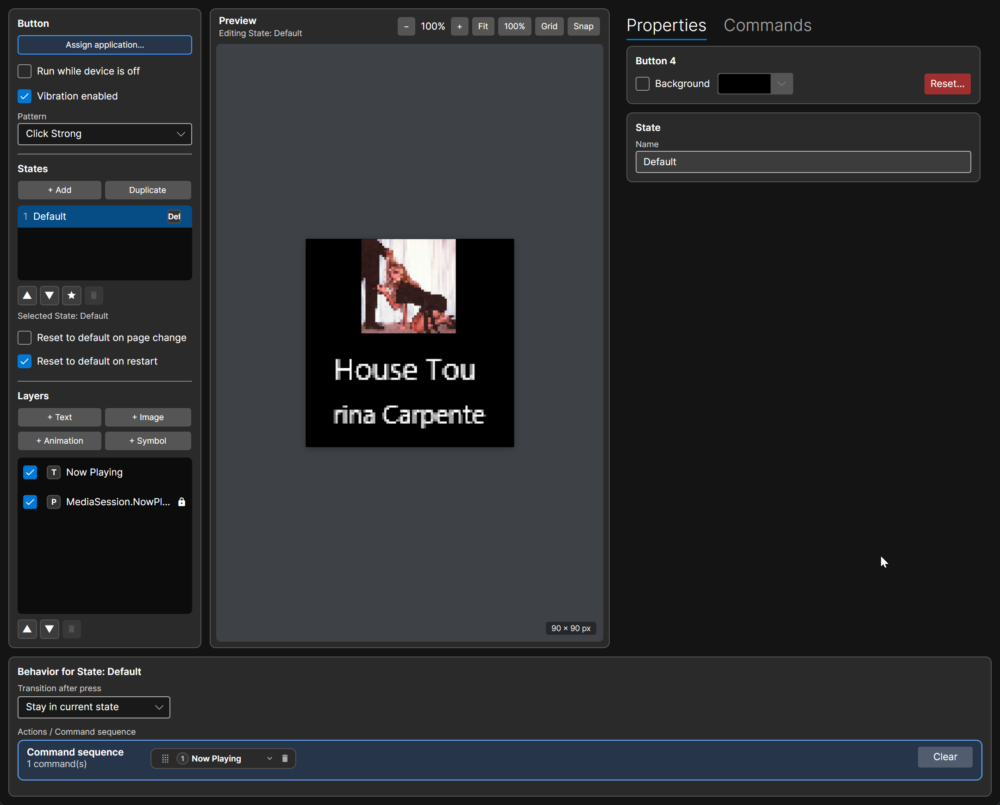
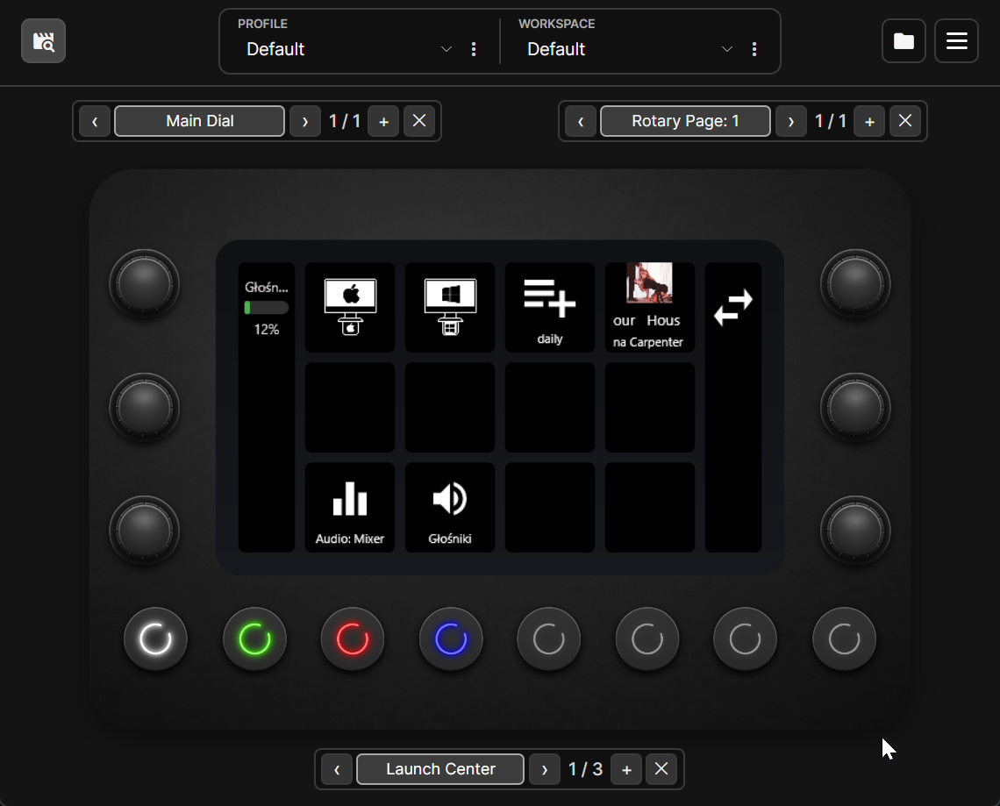
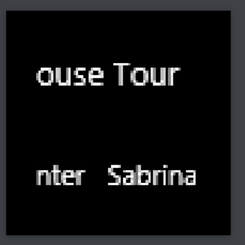
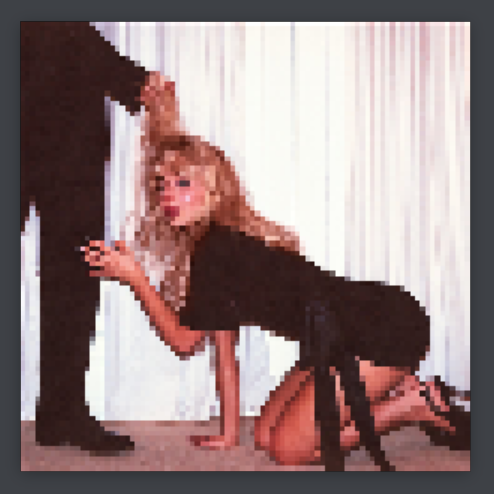

# Media Session for LoupixDeck

Show the current Windows media session on a [LoupixDeck](https://github.com/RadiatorTwo/LoupixDeck) touch button. Press the button to play or pause.

## Features

- Show artwork, title and artist from the selected Windows media session.
- Choose between artwork with text, text only and artwork only.
- Scroll long titles and artists in a continuous loop when enabled.
- Assign Next and Previous commands separately if wanted.

## Screenshots

Now Playing tile in the button editor:

LoupixDeck overview with the Now Playing tile active:

TextOnly layout with scrolling title and artist:

ArtworkOnly layout:

## Requirements

- Windows 10 version 2004 or later, or Windows 11.
- LoupixDeck 1.34.0 or later (Plugin SDK 1.26.0 or later).
- A media source that publishes a Windows Global System Media Transport Controls session.

## Installation

Download the Windows ZIP from [GitHub Releases](https://github.com/Vencite/LoupixDeck.Plugin.MediaSession/releases) and install it from the LoupixDeck Plugins window. Enable the plugin for your device, then assign Now Playing to a touch button.

For local builds and dev deployment, see [DEVELOPMENT.md](DEVELOPMENT.md).

## Use

Add **Now Playing** to a touch button. Press it to toggle playback for the selected Windows media session. The optional **Next** and **Previous** commands skip tracks.

## Button customization

Now Playing has these parameters in this order:

1. `ShowArtwork` - show artwork when available (default `true`). The `ArtworkOnly` layout center-crops artwork to fill the square button.
2. `ShowTitle` - show the track title (default `true`).
3. `ShowArtist` - show the artist (default `true`).
4. `Layout` - select a mode from the dropdown:
   - `ArtworkAndText` - artwork above the title and artist (default).
   - `TextOnly` - title and artist without artwork.
   - `ArtworkOnly` - artwork fills the whole button and is center-cropped to a square.
5. `ScrollTitle` - scroll a long title instead of shortening it (default `false`).
6. `ScrollArtist` - scroll a long artist instead of shortening it (default `false`).

Enable the matching scroll option to loop long text continuously; it does not pause on an empty frame.

## Current limitations

The plugin reads Windows media sessions. Spotify Desktop, Chrome, Edge and YouTube are examples of sources that may publish one; the plugin has no special Spotify, browser or YouTube integration. If an app or website does not expose its media through Windows Global System Media Transport Controls, the plugin cannot show or control it. Artwork is optional and appears only when the source publishes it.

### Known Spotify artwork issue

Spotify may publish the track title and artist without artwork, leaving the button with text only. We have confirmed this issue: the Windows media session returns no thumbnail, even when the track has an album cover. The plugin retries every 3 seconds while artwork is missing, but it cannot retrieve a cover that Spotify has not made available through Windows. There is currently no fix within this plugin.

Workaround: skip to the previous or next track. In our testing, this made Spotify publish artwork again.

## Development

See [DEVELOPMENT.md](DEVELOPMENT.md) for building, smoke checks, local deployment and release packaging.

## License

See [LICENSE](LICENSE).
